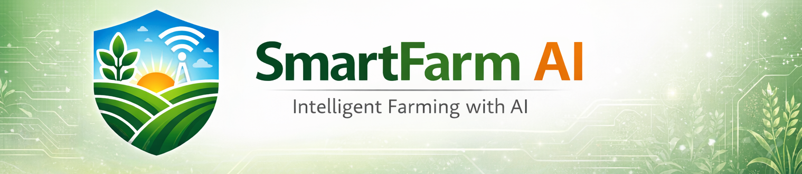
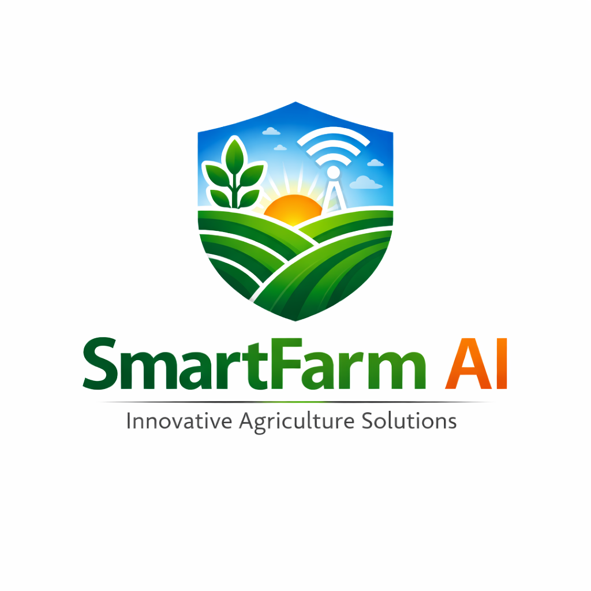
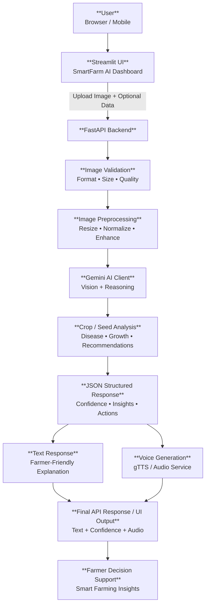

<!-- # 🌱 SmartFarm AI -->


<p align="center">
  
</p>

<h1 align="center">
   SmartFarm AI
</h1>

<p align="center">
  <strong>AI-Powered Global Agriculture Pocket Assistant 🌍</strong>
</p>
<p align="center">
  
  
  
  
  
  
</p>


---

## 🌍 Overview

**SmartFarm AI** is a **global AI-powered agriculture pocket assistant** that analyzes **crop diseases** and **seed quality** from images and delivers **actionable insights with voice support** using **Gemini multimodal AI**.

It is designed to help farmers, researchers, and agri-tech innovators make faster and smarter decisions—anywhere in the world.


### 🚀 Features

#### 🌿 Crop Disease Analysis
- Upload a crop leaf image
- Identify crop type and possible disease
- Confidence score (0–1)
- Clear disease description
- Treatment & pesticide recommendations
- Farmer-friendly guidance

#### 🌾 Seed Quality Analysis
- Upload seed images
- Detect seed quality (High / Medium / Low)
- Visual observations (damage, color, defects)
- Sowing recommendations
- Confidence-based assessment

#### 🔊 Voice Assistance
- AI-generated guidance converted into audio
- Hands-free and field-friendly usage
- Supports multilingual expansion

#### 🎨 Modern UI
- Built with Streamlit
- Light & Dark theme support
- Clean, professional SmartFarm branding
- Image preview and audio playback

---

## 🧠 Gemini AI Integration

SmartFarm AI uses **Gemini 3 Vision (`gemini-3-flash-preview`)** as its core intelligence.

Gemini is used to:
- Analyze images (crop leaves & seeds)
- Reason about diseases and quality
- Generate structured JSON responses
- Produce farmer-friendly advice text
- Enable downstream voice generation

⚠️ No heuristic or rule-based logic is used — all insights come directly from Gemini.


---

## ⚙️ Architecture Diagram




---

## 🏗️ Tech Stack

### Backend
- Python
- FastAPI
- Google Gemini 3 API
- Pillow (Image Processing)
- gTTS (Text-to-Speech)
- python-dotenv

### Frontend
- Streamlit
- Custom CSS
- Light / Dark Mode
- REST API Integration

---

## 📁 Project Structure

```text
smartfarm-ai/
│
├── backend/
│   └── app/
│       ├── __init__.py
│       ├── api/
│       │   ├── __init__.py
│       │   ├── routes.py
│       │   └── schemas.py
│       │
│       ├── services/
│       │   ├── __init__.py
│       │   ├── gemini_client.py
│       │   ├── image_processing.py
│       │   └── voice_service.py
│       │
│       └── test-data/
│
├── frontend/
│   ├── __init__.py
│   └── streamlit_app.py
│
│── assets/
│   │── banner.png
│   │── team_logo.png
│   └── smartfarm_logo.png
|
├── .env
├── .gitignore
├── LICENSE
├── README.md
├── requirements.txt
└── run_all.py
```
---

## 👥 Team 

| Name | Role & Contribution | GitHub |
|-----|------|--------|
| Moneka Meghwar |Team Lead, Frontend Developer| https://github.com/mmoneka11 |
| Kashmala Saddiqui |  Backend Developer, API Integration | https://github.com/kashmalaasif |
| Umaima Rizwan |  Documentation Lead, Development Support| https://github.com/umaim691 |

---

## 🔐 Security Notes

- .env is ignored via .gitignore
- API keys are never exposed

---

## 📌 Future Enhancements
- Mobile App (Flutter)
- Multi-language farmer support
- Offline AI inference
- Crop advisory dashboard

---

## 🙏 Acknowledgements

### Hackathon
We would like to thank the **Google Gemini 3 Hackathon** hosted on **Devpost** for providing the platform and opportunity to build and showcase **SmartFarm AI**. The hackathon inspired us to explore the capabilities of **Gemini 3 multimodal AI** for solving real-world agricultural challenges and advancing sustainable farming practices worldwide.

[-blueviolet?logo=google)](https://gemini3.devpost.com/)

We are grateful for the opportunity to collaborate, learn, and contribute — and for the encouragement to build practical, impact-driven AI for farmers everywhere. 🌱🌍

### Community & Open-source Tools
Our sincere thanks to the communities and projects that made this work possible:

- **Google Gemini AI** — https://ai.google.dev/  
- **FastAPI Community** — https://fastapi.tiangolo.com/  
- **Streamlit Team** — https://streamlit.io/  
- **Open-source contributors** — Thank you to the many maintainers and authors of libraries we used.

These communities, tools, and events inspired and enabled the development of SmartFarm AI, helping us bring practical AI solutions to agriculture worldwide 

---
## 🤝 Contributing

We welcome contributions! Please open issues or pull requests.

⭐ **Support this project:** If you find this project useful, please star the repo!
[](https://github.com/mmoneka11/CropGuard-AI/stargazers)

---

## 📜 License
This project is for educational, research, and demonstration purposes | MIT License

---

<p align="center"> 🌾 <b>Developed with ❤️ by the IGOGs Team</b><br> Building AI for Sustainable Agriculture ✨ </p> 
